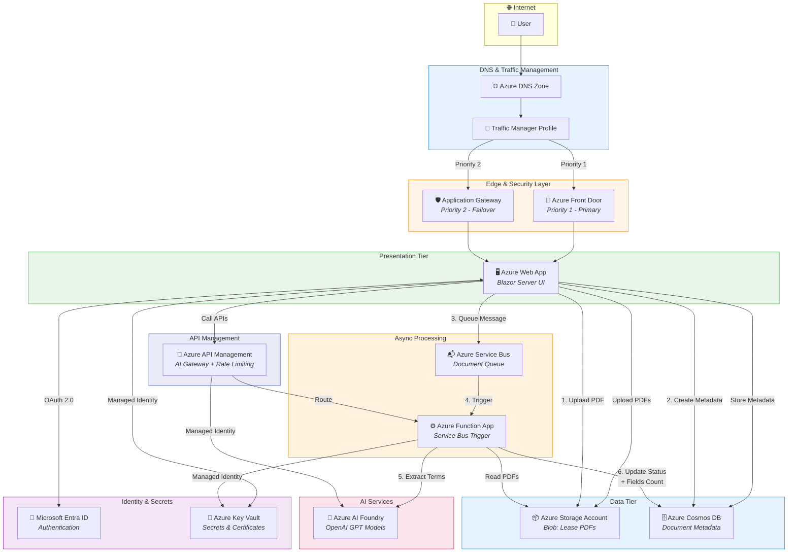
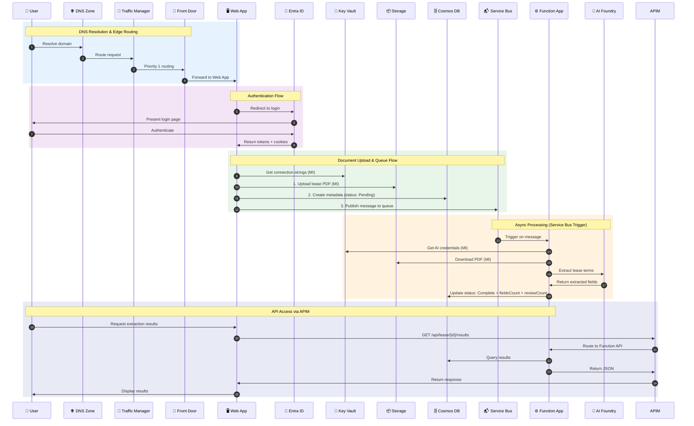
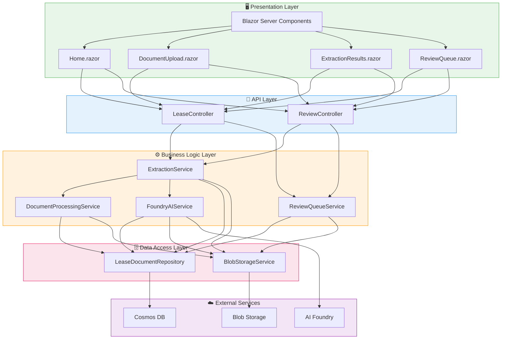
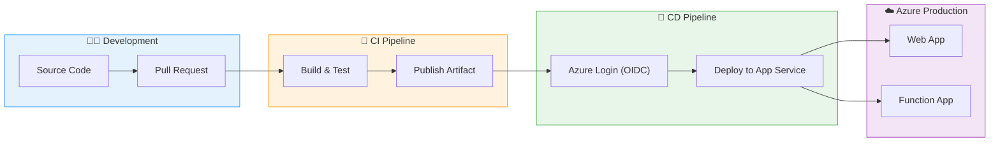

# Lease Document Intelligence - Architecture

## Azure Infrastructure Architecture



---

## Request Flow Diagram



---

## Component Responsibilities

| Component | Responsibility | Authentication |
|-----------|---------------|----------------|
| **Azure DNS Zone** | Domain name resolution, record management | N/A |
| **Traffic Manager** | Geographic routing, failover between regions | N/A |
| **Front Door** | Global load balancing, WAF, SSL termination, CDN | Managed Identity |
| **Application Gateway** | Regional load balancing, WAF, SSL offloading | Managed Identity |
| **Web App (Blazor)** | UI rendering, user interaction, file upload | Entra ID OAuth 2.0 |
| **Entra ID** | User authentication, role-based authorization | N/A |
| **Key Vault** | Secrets, certificates, connection strings | Managed Identity |
| **Storage Account** | Blob storage for lease PDFs | Managed Identity |
| **Cosmos DB** | Document metadata, extraction results, status tracking | Managed Identity |
| **Service Bus** | Async message queue for document processing | Managed Identity |
| **Function App** | Service Bus trigger, AI orchestration, APIs | Managed Identity |
| **AI Foundry (OpenAI)** | LLM for lease term extraction | Managed Identity via APIM |
| **API Management** | API gateway, rate limiting, AI gateway policies | Managed Identity |

---

## N-Tier Application Layers



### 1. Presentation Layer
**Location**: `LeaseDocumentIntelligence/Components/`
- **Blazor Components** (.razor files)
  - `Pages/Home.razor` - Dashboard & landing page
  - `Pages/DocumentUpload.razor` - File upload interface
  - `Pages/ExtractionResults.razor` - Results display with citations
  - `Pages/ReviewQueue.razor` - Human review interface
- **Responsibilities**: User interaction, file upload handling, results visualization

### 2. API Layer
**Location**: `LeaseDocumentIntelligence.API/Controllers/`
- **LeaseController.cs**
  - `POST /api/lease/upload` - Upload document
  - `GET /api/lease/{id}/results` - Get extraction results
  - `GET /api/lease/{id}/status` - Get document status
  - `GET /api/lease` - List all documents
- **ReviewController.cs**
  - `GET /api/review/pending` - Get pending review items
  - `POST /api/review/{id}/approve` - Approve extraction
  - `POST /api/review/{id}/reject` - Correct and reject

### 3. Business Logic Layer
**Location**: `LeaseDocumentIntelligence.Infrastructure/Services/`

#### Service Interfaces
- **IDocumentProcessingService** - PDF text extraction & validation
- **IFoundryAIService** - LLM calls with Managed Identity
- **IExtractionService** - Orchestrates extraction workflow
- **IReviewQueueService** - Manages low-confidence field routing

#### Implementations
- **DocumentProcessingService**
  - Uses PdfPig (UglyToad.PdfPig) for PDF parsing
  - Validates file format & size
  - Extracts text per page

- **FoundryAIService**
  - Calls Azure Foundry Models via HttpClientFactory
  - Uses DefaultAzureCredential (Managed Identity)
  - Prompts: extraction & validation
  - Parses JSON responses
  - Confidence scoring & citation extraction

- **ExtractionService**
  - Coordinates full extraction pipeline
  - Routes low-confidence items to review queue
  - Updates document status
  - Builds summary statistics

- **ReviewQueueService**
  - Manages review queue (in-memory for MVP)
  - Approval/rejection workflow
  - Tracks reviewer & timestamp

### 4. Data Access Layer
**Location**: `LeaseDocumentIntelligence/Infrastructure/Data/`
- **ILeaseDocumentRepository** - Data access interface
- **LeaseDocumentRepository** - In-memory implementation (extensible to EF Core/SQL)
  - CRUD operations
  - Document lifecycle management

### 5. Domain Layer
**Location**: `LeaseDocumentIntelligence/Domain/`

#### Models
- **LeaseDocument** - Document metadata & lifecycle
- **ExtractedField** - Field with confidence, citations, source
- **ReviewQueueItem** - Low-confidence item for human review

#### DTOs
- **ExtractionResultDto** - Results response
- **ExtractedFieldDto** - Field response
- **ReviewQueueItemDto** - Review item response

#### Constants
- **LeaseFieldDefinitions** - 40-60 predefined fields with metadata

## Key Architecture Decisions

### Async-First with HttpClientFactory
```csharp
services.AddHttpClient<IFoundryAIService, FoundryAIService>();
```
- All service methods are async
- HttpClientFactory manages connection pooling
- Scalable for high throughput

### Managed Identity for Azure Auth
```csharp
using var tokenProvider = new DefaultAzureCredential();
var token = await tokenProvider.GetTokenAsync(...);
```
- No credential strings in config
- Works in local dev (VS, CLI) and production (App Service, AKS)
- Azure RBAC for fine-grained permissions

### Confidence-Based Triage
- **≥70% confidence**: Approved automatically
- **<70% confidence**: Routed to review queue
- Reviewer can approve or correct with notes
- Maintains audit trail

### Separation of Concerns
- Services are testable (mocked in unit tests)
- DTOs decouple API contracts from domain models
- Repository pattern isolates data access (easy to swap in SQL)

## Scalability Considerations

### Current (MVP)
- In-memory data store
- Single document processing at a time
- Synchronous review workflow

### Future Enhancements
- **Phase 2**: Azure Service Bus, Function App triggers, APIM AI Gateway, batch uploads, Redis caching
- **Phase 3**: Multi-region deployment, Azure AI Search, SignalR notifications

### Reducing Human-in-the-Loop (Phase 3+)

The current architecture routes low-confidence extractions (<70%) to human review. To minimize manual intervention over time:

| Strategy | Implementation | Benefit |
|----------|---------------|---------|
| **Prompt Flow Evals** | Create evaluation datasets from reviewed extractions | Measure accuracy, identify prompt improvements |
| **Ground Truth Dataset** | Build labeled dataset from human-approved extractions | Benchmark model performance objectively |
| **Confidence Calibration** | Analyze reviewed items to tune thresholds | Reduce false positives in review queue |
| **Fine-Tuning** | Train on domain-specific lease terminology | Improve extraction accuracy for edge cases |
| **Active Learning** | Prioritize uncertain items for review | Maximize learning from minimal human effort |
| **Prompt Versioning** | A/B test prompts via Prompt Flow experiments | Data-driven prompt optimization |
| **Automated Regression** | Run eval suite before deployment | Prevent quality degradation |

**Goal**: Progressively reduce human review to only true edge cases (ambiguous clauses, non-standard formats).

## Architecture Pillars

This architecture is designed around the **Azure Well-Architected Framework** pillars:

### 🔐 Security
| Feature | Implementation |
|---------|---------------|
| **User Authentication** | Microsoft Entra ID (OAuth 2.0 / OIDC) |
| **Authorization** | Policy-based RBAC (Admin, Reviewer, User roles) |
| **Service-to-Service Auth** | Managed Identity (zero secrets in code) |
| **Secrets Management** | Azure Key Vault as configuration provider |
| **Network Security** | Private Endpoints, NSG, VNET integration |
| **Edge Protection** | WAF on Front Door, DDoS Protection Standard |
| **Data Encryption** | TLS 1.3 in-transit, CMK at-rest |

### 🔄 Disaster Recovery (DR)
| Feature | Implementation |
|---------|---------------|
| **Multi-Region Database** | Cosmos DB with multi-region writes |
| **Global Traffic Routing** | Traffic Manager with priority-based failover |
| **Geo-Redundant Storage** | GRS for blob storage (lease PDFs) |
| **Regional Failover** | Front Door (Priority 1) → App Gateway (Priority 2) |
| **RPO/RTO** | Near-zero RPO with Cosmos, minutes RTO with Traffic Manager |

### ⚡ High Availability (HA)
| Feature | Implementation |
|---------|---------------|
| **Load Balancing** | Azure Front Door (global), App Gateway (regional) |
| **Auto-Failover** | Traffic Manager health probes with automatic routing |
| **Zone Redundancy** | App Service, Functions, Cosmos DB zone-redundant |
| **Service Bus** | Premium tier with availability zones |
| **Health Monitoring** | Application Insights with alerting |

### 📈 Scalability
| Feature | Implementation |
|---------|---------------|
| **Async Processing** | Service Bus queue decouples upload from extraction |
| **Serverless Compute** | Function App auto-scales on demand |
| **Concurrent Processing** | Multiple Function instances process queue in parallel |
| **Connection Pooling** | HttpClientFactory for efficient HTTP connections |
| **Cosmos DB** | Serverless/autoscale with unlimited throughput |
| **CDN** | Front Door caches static content at edge |

### 🛡️ Resiliency
| Feature | Implementation |
|---------|---------------|
| **Message Durability** | Service Bus guarantees at-least-once delivery |
| **Dead-Letter Queue** | Failed messages preserved for analysis |
| **Retry Policies** | Exponential backoff on transient failures |
| **Circuit Breaker** | APIM policies prevent cascade failures |
| **Graceful Degradation** | Low-confidence items queue for human review |
| **Idempotent Operations** | Safe to retry extraction operations |

### 📊 Observability
| Feature | Implementation |
|---------|---------------|
| **Distributed Tracing** | Application Insights end-to-end correlation |
| **Structured Logging** | ILogger with App Insights sink |
| **Log Levels** | Warning/Error only (no verbose logs in production) |
| **Metrics** | Request rates, latencies, error rates |
| **Alerting** | Smart detection + custom alerts |
| **Dashboards** | Azure Monitor workbooks |

---

## Code Style

Follows [Microsoft C# Coding Conventions](https://learn.microsoft.com/en-us/dotnet/csharp/fundamentals/coding-style/coding-conventions):
- PascalCase for public members
- camelCase for private fields
- Async methods end with `Async`
- Use `var` for obvious types, explicit for clarity
- Modern C# features (records, nullable checks, etc.)

## Testing

### Unit Test Project
- **LeaseDocumentIntelligence.Tests**
- xUnit framework
- Moq for dependency injection
- FluentAssertions for readable tests

**Test Coverage**:
- DocumentProcessingService - validation & extraction
- ExtractionService - orchestration & error handling
- ReviewQueueService - queue management
- LeaseDocumentRepository - CRUD operations

## Deployment Architecture



### CI/CD Pipeline (GitHub Actions)
- **Build**: Restore, build, test all projects
- **Publish**: Create deployment artifact
- **Deploy**: Azure login via OIDC (Managed Identity), publish to App Service

### Azure Resources Required
| Resource | Purpose | SKU |
|----------|---------|-----|
| App Service Plan | Host Web App | P1v3 |
| Web App | Blazor Server UI | .NET 10 |
| Function App | Document processing APIs | Consumption |
| Storage Account | Lease PDF blobs | Standard_GRS |
| Cosmos DB | Document metadata | Serverless |
| Key Vault | Secrets & certificates | Standard |
| API Management | AI Gateway, rate limiting | Developer |
| Application Insights | Telemetry & logging | Basic |
| Front Door | Global load balancing | Standard |
| Application Gateway | Regional LB, WAF | WAF_v2 |

## API Documentation

- **OpenAPI**: `/openapi/v1.json`
- **Scalar UI**: `/scalar/v1` (development only)

All endpoints documented with XML comments and OpenAPI metadata.
