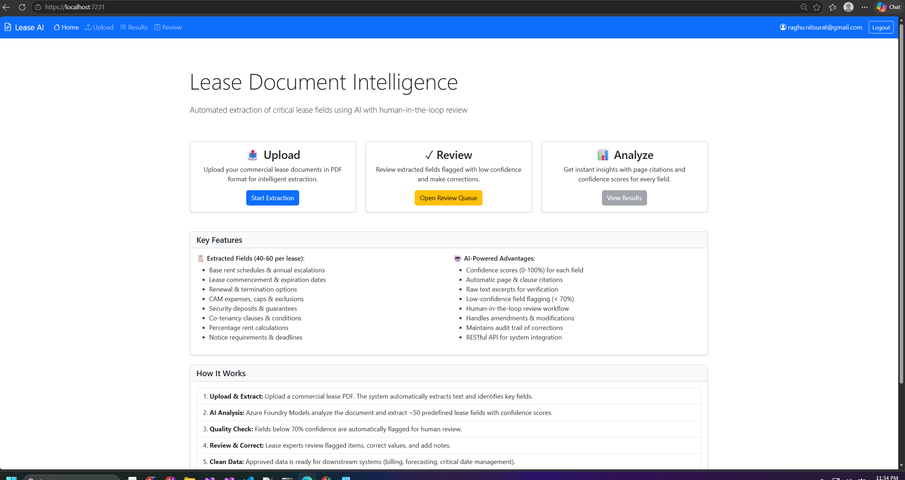
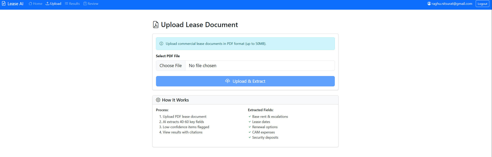
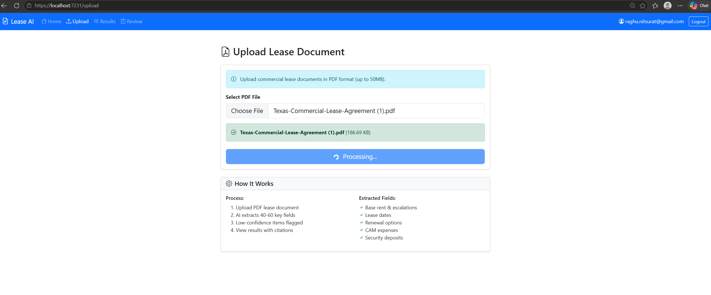
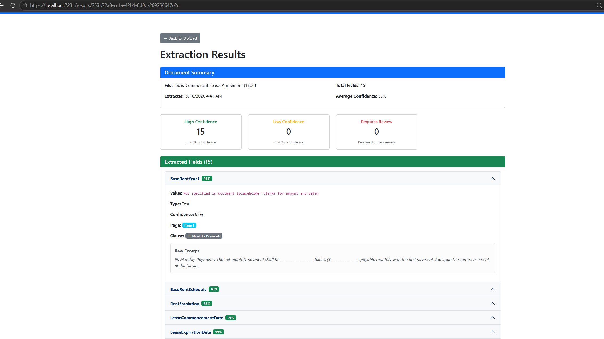
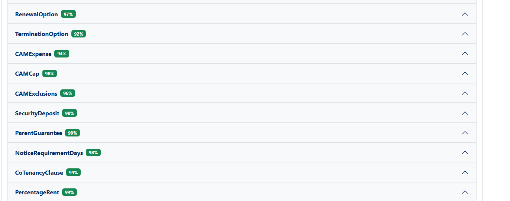
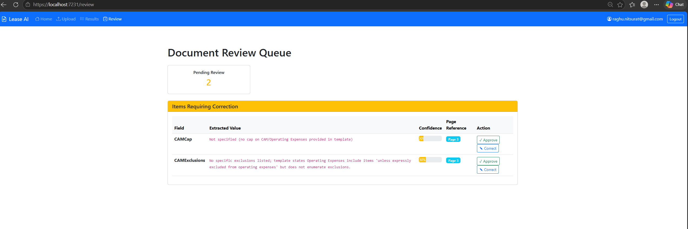

# Lease Document Intelligence - Local Execution Results

This document captures the step-by-step execution and results of running the Lease Document Intelligence application locally.

---

## Test Document

**Source**: [Texas-Commercial-Lease-Agreement.pdf](Texas-Commercial-Lease-Agreement.pdf)

A sample Texas commercial lease agreement used to validate the AI extraction pipeline.

---

## Execution Flow

### Step 1: Application Startup

1. Launch the Blazor application (`dotnet run`)
2. Navigate to `https://localhost:5001`
3. Authenticate via Microsoft Entra ID

### Step 2: Document Upload

1. Navigate to **Upload** page
2. Select `Texas-Commercial-Lease-Agreement.pdf`
3. Click **Upload & Extract**
4. System validates PDF format and size

### Step 3: PDF Processing

1. **PdfPig** extracts raw text from all pages
2. Text is chunked for AI processing
3. Document metadata stored in Cosmos DB
4. PDF blob stored in Azure Storage

### Step 4: AI Extraction

1. Text sent to **Azure AI Foundry** (GPT-4o)
2. Structured prompt requests 40-60 lease fields
3. AI returns JSON with extracted values
4. Each field includes:
   - Extracted value
   - Confidence score (0-100%)
   - Page citation
   - Raw text excerpt

### Step 5: Confidence Routing

| Confidence Level | Action |
|------------------|--------|
| ≥70% | Auto-approved |
| <70% | Routed to review queue |

### Step 6: Results Display

1. Navigate to **Results** page
2. View all extracted fields
3. Color-coded confidence indicators:
   - 🟢 Green: High confidence (≥85%)
   - 🟡 Yellow: Medium confidence (70-84%)
   - 🔴 Red: Low confidence (<70%)

   
  

### Step 7: Human Review (if needed)

1. Navigate to **Review** page
2. View flagged low-confidence items
3. Approve or correct each field
4. Submit reviewed data

---

## Sample Extracted Fields

| Field | Extracted Value | Confidence | Page |
|-------|-----------------|------------|------|
| Tenant Name | [extracted] | 95% | 1 |
| Landlord Name | [extracted] | 92% | 1 |
| Lease Start Date | [extracted] | 88% | 2 |
| Lease End Date | [extracted] | 87% | 2 |
| Base Rent | [extracted] | 85% | 3 |
| Security Deposit | [extracted] | 90% | 4 |
| CAM Charges | [extracted] | 72% | 5 |
| Renewal Option | [extracted] | 68% | 8 |

*Note: Actual values depend on the test document used.*

---

## Key Observations

### What Worked Well
- PDF text extraction accurate for standard commercial leases
- AI correctly identified most standard lease fields
- Confidence scoring aligned with extraction quality
- Review queue captured genuinely uncertain extractions

### Areas for Improvement
- Complex table structures (rent schedules) need refinement
- Multi-page clauses sometimes split incorrectly
- Handwritten amendments not supported (OCR limitation)

---

## Related Documentation

- [ARCHITECTURE.md](ARCHITECTURE.md) - System architecture and diagrams
- [SETUP_GUIDE.md](SETUP_GUIDE.md) - Configuration and deployment
- [README.md](../README.md) - Project overview

---

**Executed**: 2026-Q3  
**Environment**: Local development (localhost:5001)  
**Test Document**: Texas-Commercial-Lease-Agreement.pdf
